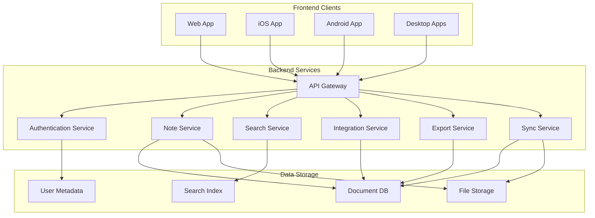
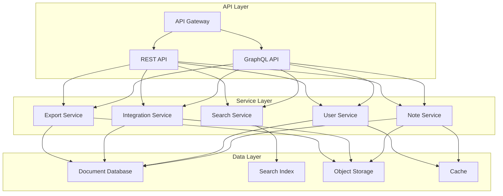
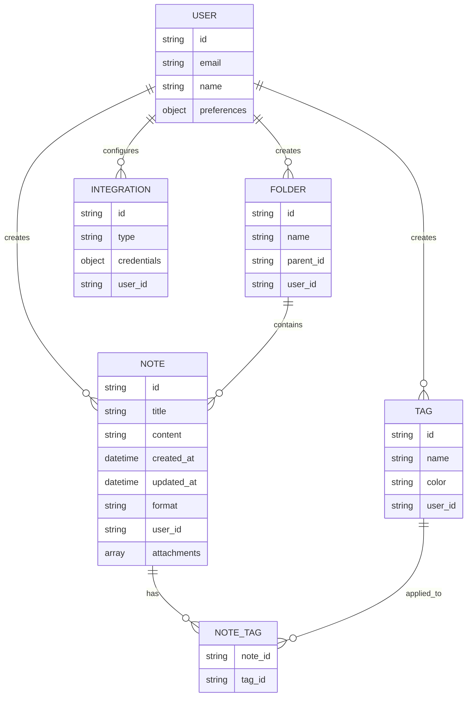
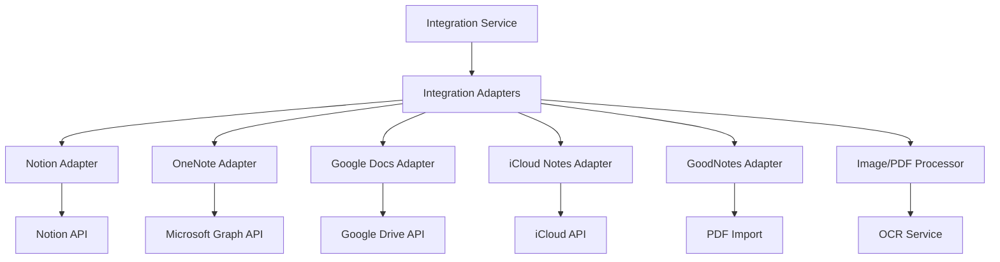

# Conduit: Note Aggregator Project Plan

Based on your requirements, I've developed a comprehensive project plan for Conduit, your note aggregator system. This plan addresses your need for a unified platform that can aggregate notes from various sources, provide powerful search capabilities, and work across multiple devices.

## Project Overview

Conduit will be a cross-platform system designed to solve the problem of scattered notes across different formats and platforms. It will provide a centralized repository for all notes with powerful organization, search, and integration capabilities.

## 1. Problem Statement & Value Proposition

### Problem Definition
Users have notes scattered across multiple platforms (physical and digital) making it difficult to:
- Find specific information when needed
- Maintain organization across different systems
- Access notes from different devices
- Keep track of related information

### Value Proposition
- Unified access to all notes regardless of original source
- Powerful search capabilities including semantic search
- Consistent organization system across all platforms
- Seamless integration with existing note-taking tools
- Cross-platform availability

## 2. System Architecture

### Key Components:

1. **Frontend Clients**
   - Web application (React/Vue)
   - Mobile apps (React Native or Flutter)
   - Desktop apps (Electron)

2. **Backend Services**
   - API Gateway: Central entry point for all client requests
   - Authentication Service: User management and security
   - Note Service: Core note CRUD operations
   - Search Service: Advanced search capabilities including semantic search
   - Integration Service: Connectors to external platforms
   - Export Service: Handles conversion to different formats
   - Sync Service: Manages offline capabilities and synchronization

3. **Data Storage**
   - Document DB: Primary storage for notes (MongoDB/Firestore)
   - Search Index: Optimized for search (Elasticsearch/Meilisearch)
   - User Metadata: User preferences and settings
   - File Storage: For attachments and binary data

## 3. Functional Requirements

### Core Features

1. **Note Management**
   - Create, read, update, delete notes
   - Support for rich text, markdown, images
   - Version history and change tracking
   - Folder and tag-based organization

2. **Search Capabilities**
   - Full-text search across all notes
   - Tag-based filtering
   - Semantic search for concept-based queries
   - Search within specific folders/categories

3. **Integration System**
   - Import from Notion, OneNote, Google Docs, iCloud Notes
   - Import from GoodNotes (via PDF/image)
   - Capture system for physical notes (via camera)
   - Whiteboard capture and digitization

4. **Export Capabilities**
   - Export to markdown, PDF, TXT, DOCX
   - Batch export of multiple notes
   - Custom templates for exports

5. **Synchronization**
   - Cross-device sync
   - Offline access and editing
   - Conflict resolution

## 4. Technical Architecture

### Backend Architecture

### Data Model

## 5. Implementation Plan

### Phase 1: MVP (3 months)
- Web application with basic note management
- Simple folder and tag organization
- Basic search functionality
- Manual import/export capabilities
- User authentication and data security

### Phase 2: Enhanced Features (3 months)
- Mobile applications (iOS and Android)
- Advanced search capabilities
- Integration with major platforms (Notion, OneNote)
- Improved organization with smart suggestions
- Offline capabilities

### Phase 3: Advanced Features (3 months)
- Desktop applications
- Semantic search implementation
- AI-based organization and tagging
- Advanced integrations (GoodNotes, whiteboard capture)
- Collaboration features

### Phase 4: Refinement (Ongoing)
- Performance optimization
- User experience improvements
- Additional integrations
- Advanced AI features

## 6. Technology Stack Recommendations

### Frontend
- **Web**: React.js with TypeScript, Redux for state management
- **Mobile**: React Native or Flutter
- **Desktop**: Electron

### Backend
- **API**: Node.js with Express or NestJS
- **GraphQL**: Apollo Server
- **Authentication**: JWT, OAuth2

### Data Storage
- **Document DB**: MongoDB or Firestore
- **Search Engine**: Elasticsearch or Meilisearch
- **Object Storage**: AWS S3 or Google Cloud Storage
- **Cache**: Redis

### Infrastructure
- **Containerization**: Docker
- **Orchestration**: Kubernetes
- **CI/CD**: GitHub Actions or GitLab CI
- **Hosting**: AWS, Google Cloud, or Azure

## 7. Integration Strategy

### Integration Approach
1. **API-based Integration**: Direct connection to platforms with available APIs
2. **File-based Integration**: Import/export for platforms without APIs
3. **Image Processing**: OCR for handwritten notes and whiteboard captures
4. **Browser Extensions**: For web-based capture from various sources

## 8. Key Technical Challenges

1. **Unified Data Model**: Creating a flexible schema that accommodates various note types
2. **Semantic Search**: Implementing effective semantic search across diverse content
3. **Synchronization**: Ensuring reliable sync across devices with offline capabilities
4. **Integration Complexity**: Managing connections to multiple external platforms
5. **Performance**: Maintaining speed with potentially large volumes of notes and attachments

## 9. Development Specification Approach

Rather than creating exhaustive detailed specifications for all components upfront, Conduit will use a "just-in-time" specification approach:

1. **The MVP scope document** serves as the foundation and high-level guide
2. **Detailed specifications** will be created immediately before implementing each component
3. **Sprint-by-sprint focus** - create detailed specs only for components in the current sprint

This approach offers several benefits:
- Prevents wasting time on specs that might change as development progresses
- Allows for learning and adjustment throughout the development process
- Keeps documentation aligned with actual implementation
- Focuses energy on what's immediately needed

Each sprint will begin with creating detailed specifications for the components to be implemented in that sprint, including API endpoint definitions, UI wireframes, workflow diagrams, edge cases, and specific implementation details.

## 10. Next Steps

1. **Validate Architecture**: Review the proposed architecture and adjust as needed
2. **Define MVP Scope**: Finalize the specific features for the initial release
3. **Set Up Development Environment**: Establish the initial project structure and tooling
4. **Begin Sprint 1**: Start with detailed specifications for authentication and core note functionality
