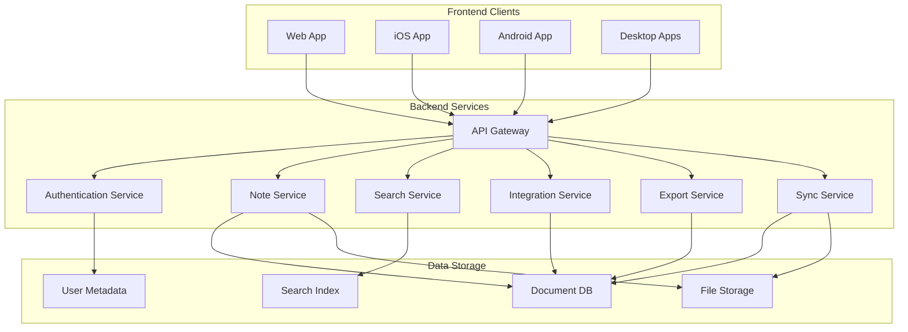
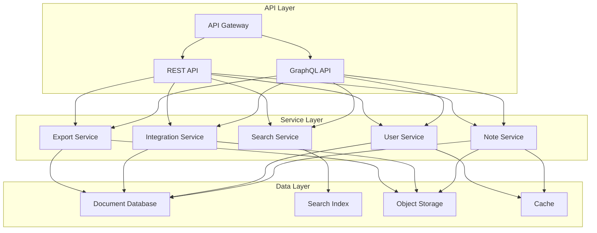
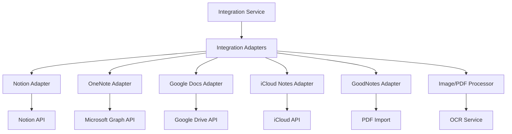
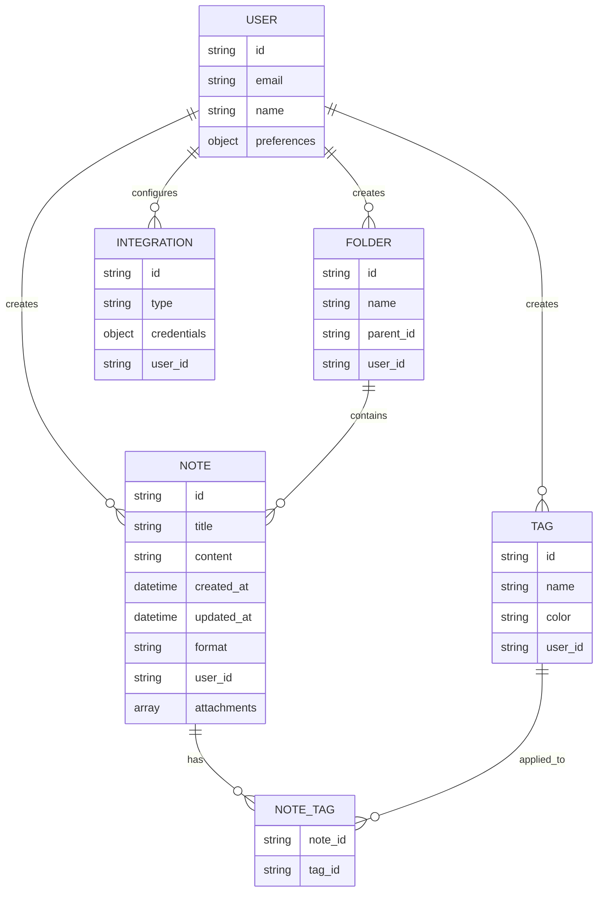

# System Patterns: Conduit Note Aggregator

## System Architecture

Conduit follows a microservices architecture to provide flexibility, scalability, and maintainability. The system is divided into distinct services, each with a specific responsibility, communicating through well-defined interfaces.

### High-Level Architecture

### Backend Architecture

## Key Technical Decisions

### 1. Microservices Architecture

**Decision**: Implement a microservices-based architecture rather than a monolithic design.

**Rationale**:
- Enables independent development and deployment of services
- Allows different services to use technologies best suited for their specific functions
- Facilitates scaling individual components based on demand
- Improves fault isolation and system resilience
- Supports the evolving nature of the product with cleaner boundaries

### 2. API Gateway Pattern

**Decision**: Implement an API Gateway as the single entry point for all client requests.

**Rationale**:
- Provides a unified entry point for all client requests
- Handles cross-cutting concerns like authentication, logging, and rate limiting
- Translates between client-specific protocols and internal service communication
- Abstracts the internal architecture from clients
- Enables platform-agnostic backend services

### 3. Dual API Support (REST and GraphQL)

**Decision**: Support both REST and GraphQL APIs.

**Rationale**:
- REST provides simplicity for basic CRUD operations and has broader tool support
- GraphQL allows clients to request exactly the data they need, reducing over-fetching
- Mobile apps particularly benefit from GraphQL's efficiency over limited bandwidth
- Different client needs can be served by the most appropriate protocol

### 4. Document Database for Primary Storage

**Decision**: Use a document database (MongoDB/Firestore) for primary note storage.

**Rationale**:
- Provides flexible schema that can evolve over time
- Supports storing different types of notes with varying structures
- Enables easier addition of new fields and attributes
- Better matches the document-oriented nature of notes
- Simplifies development with JSON-like data structures

### 5. Specialized Storage for Different Data Types

**Decision**: Use specialized storage systems for different types of data.

**Rationale**:
- Document DB for structured note content
- Search Index (Elasticsearch/Meilisearch) for efficient text search
- Object Storage for binary attachments and files
- Cache for frequently accessed data
- Each type of data is stored in the most efficient way for its access patterns

## Design Patterns in Use

### 1. CQRS (Command Query Responsibility Segregation)

**Implementation**: Separation of write operations (Note Service) from read/query operations (Search Service).

**Benefits**:
- Optimizes each path for its specific needs
- Improves performance by using specialized data models for different operations
- Enables independent scaling of read and write workloads
- Facilitates more complex query capabilities through specialized search technology

### 2. Adapter Pattern for Integrations

**Implementation**: Integration Service uses adapters for each external platform.

**Benefits**:
- Defines a common interface for all integrations
- Allows adding new adapters without changing the core system
- Isolates integration-specific code and dependencies
- Simplifies testing and maintenance

### 3. Event-Driven Communication

**Implementation**: Services communicate through events for asynchronous operations.

**Benefits**:
- Decouples services for better scalability and resilience
- Enables asynchronous processing for better responsiveness
- Facilitates complex workflows across multiple services
- Supports eventual consistency where appropriate

### 4. Repository Pattern

**Implementation**: Data access is abstracted through repositories in each service.

**Benefits**:
- Centralizes data access logic
- Provides a consistent interface for data operations
- Simplifies testing through mock repositories
- Decouples business logic from data access details

### 5. Backend for Frontend (BFF)

**Implementation**: API Gateway implements tailored endpoints for specific frontend needs.

**Benefits**:
- Optimizes API responses for different client types
- Reduces data transfer for bandwidth-constrained clients
- Simplifies client-side code by moving aggregation to the server
- Improves performance by reducing round-trips

## Component Relationships

### Data Model

### Critical Implementation Paths

#### Note Creation and Indexing

1. Client sends note creation request to API Gateway
2. API Gateway authenticates and routes to Note Service
3. Note Service validates and stores note in Document DB
4. Note Service publishes "Note Created" event
5. Search Service consumes event and indexes note content
6. Sync Service consumes event and queues for device synchronization

#### Search Execution

1. Client sends search query to API Gateway
2. API Gateway authenticates and routes to Search Service
3. Search Service executes query against Search Index
4. Search Service retrieves matching note metadata
5. Results are returned to client via API Gateway

#### Integration Import

1. Client initiates import from external platform
2. API Gateway routes to Integration Service
3. Integration Service uses appropriate adapter to fetch data
4. Integration Service transforms data to internal format
5. Integration Service calls Note Service to create notes
6. Normal note creation flow continues from there

## MVP Architecture Simplifications

For the MVP, the architecture will be simplified:

1. **Focused Services**: Initially implementing only:
   - Authentication Service
   - Note Service
   - Search Service
   - Basic Import/Export functionality

2. **Simplified Storage**:
   - MongoDB for document storage
   - Elasticsearch for search indexing
   - Simple file storage for attachments

3. **Web-First Approach**:
   - Only implementing the web client initially
   - PWA features for basic offline functionality
   - Responsive design for mobile web access

This simplified architecture establishes the foundation while allowing for expansion to the full architecture in future phases.
